# System Flow Diagram - Daily Stand Up App

This document provides comprehensive flow diagrams for the Daily Stand Up App using Mermaid syntax. The diagrams illustrate the complete system architecture, user interactions, and automated processes.

## 0. Entity Relationship Diagram (ERD)

```mermaid
erDiagram
    %% Core Django User Model
    User {
        int id PK
        string username
        string email
        string first_name
        string last_name
        boolean is_active
        datetime date_joined
        datetime last_login
    }

    %% Teams App Models
    Team {
        int id PK
        string name UK
        text description
        string slack_channel_id UK
        boolean is_active
        datetime created_at
        datetime updated_at
    }

    TeamMember {
        int id PK
        int user_id FK
        int team_id FK
        string role
        string slack_user_id
        boolean is_active
        datetime joined_at
    }

    StandupSchedule {
        int id PK
        int team_id FK
        json weekdays
        time reminder_time
        time end_time
        string timezone
        boolean is_active
        datetime created_at
    }

    %% Standups App Models
    Standup {
        int id PK
        int team_id FK
        date date
        string status
        datetime started_at
        datetime ended_at
        string slack_thread_ts
        datetime created_at
        datetime updated_at
    }

    StandupResponse {
        int id PK
        int standup_id FK
        int user_id FK
        text yesterday_work
        text today_work
        text blockers
        string mood
        datetime submitted_at
        datetime updated_at
        string slack_message_ts
    }

    StandupReminder {
        int id PK
        int standup_id FK
        int user_id FK
        string reminder_type
        datetime sent_at
        string slack_message_ts
        boolean responded
    }

    StandupMetrics {
        int id PK
        int team_id FK
        date date
        int total_members
        int responses_count
        float completion_rate
        duration average_response_time
        time first_response_time
        time last_response_time
        json mood_distribution
        datetime created_at
    }

    %% Slack Integration App Models
    SlackWorkspace {
        int id PK
        string team_id UK
        string team_name
        string bot_user_id
        text bot_access_token
        boolean is_active
        datetime installed_at
        datetime updated_at
    }

    SlackMessage {
        int id PK
        int workspace_id FK
        string channel_id
        string user_id
        string message_ts UK
        string thread_ts
        string message_type
        text content
        int standup_id FK
        datetime sent_at
    }

    SlackInteraction {
        int id PK
        int workspace_id FK
        string user_id
        string interaction_type
        string trigger_id
        string callback_id
        json payload
        json response_data
        int standup_id FK
        datetime created_at
    }

    SlackUserMapping {
        int id PK
        int user_id FK
        string slack_user_id UK
        string slack_username
        string slack_email
        int workspace_id FK
        boolean is_active
        datetime created_at
        datetime updated_at
    }

    SlackChannelMapping {
        int id PK
        int team_id FK
        int workspace_id FK
        string channel_id
        string channel_name
        boolean is_private
        boolean is_active
        datetime created_at
        datetime updated_at
    }

    %% Relationships
    %% User relationships
    User ||--o{ TeamMember : "belongs to"
    User ||--o{ StandupResponse : "submits"
    User ||--o{ StandupReminder : "receives"
    User ||--|| SlackUserMapping : "maps to"

    %% Team relationships
    Team ||--o{ TeamMember : "has members"
    Team ||--o{ StandupSchedule : "has schedules"
    Team ||--o{ Standup : "conducts"
    Team ||--o{ StandupMetrics : "generates"
    Team ||--|| SlackChannelMapping : "maps to"

    %% Standup relationships
    Standup ||--o{ StandupResponse : "receives"
    Standup ||--o{ StandupReminder : "triggers"
    Standup ||--o{ SlackMessage : "generates"
    Standup ||--o{ SlackInteraction : "involves"

    %% Slack Workspace relationships
    SlackWorkspace ||--o{ SlackMessage : "hosts"
    SlackWorkspace ||--o{ SlackInteraction : "handles"
    SlackWorkspace ||--o{ SlackUserMapping : "contains"
    SlackWorkspace ||--o{ SlackChannelMapping : "includes"

    %% Unique constraints and indexes (shown as comments)
    %% TeamMember: unique(user_id, team_id)
    %% Standup: unique(team_id, date)
    %% StandupResponse: unique(standup_id, user_id)
    %% StandupMetrics: unique(team_id, date)
    %% SlackUserMapping: unique(slack_user_id, workspace_id)
    %% SlackChannelMapping: unique(channel_id, workspace_id)
```

## 1. Overall System Architecture

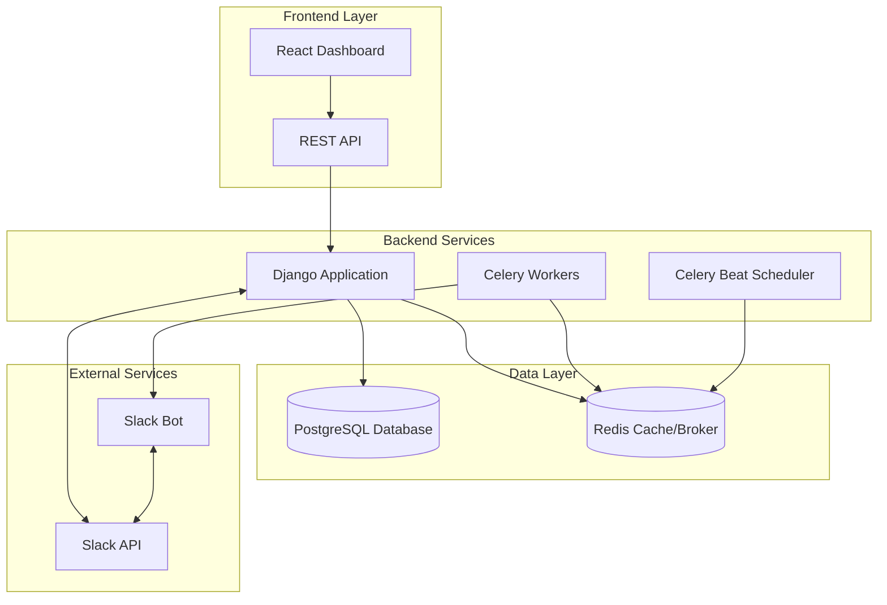

## 2. User Authentication and Team Setup Flow

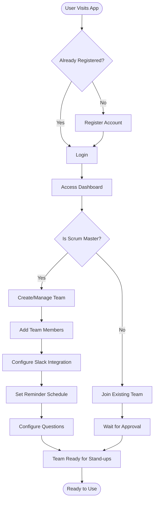

## 3. Daily Stand-up Automated Flow

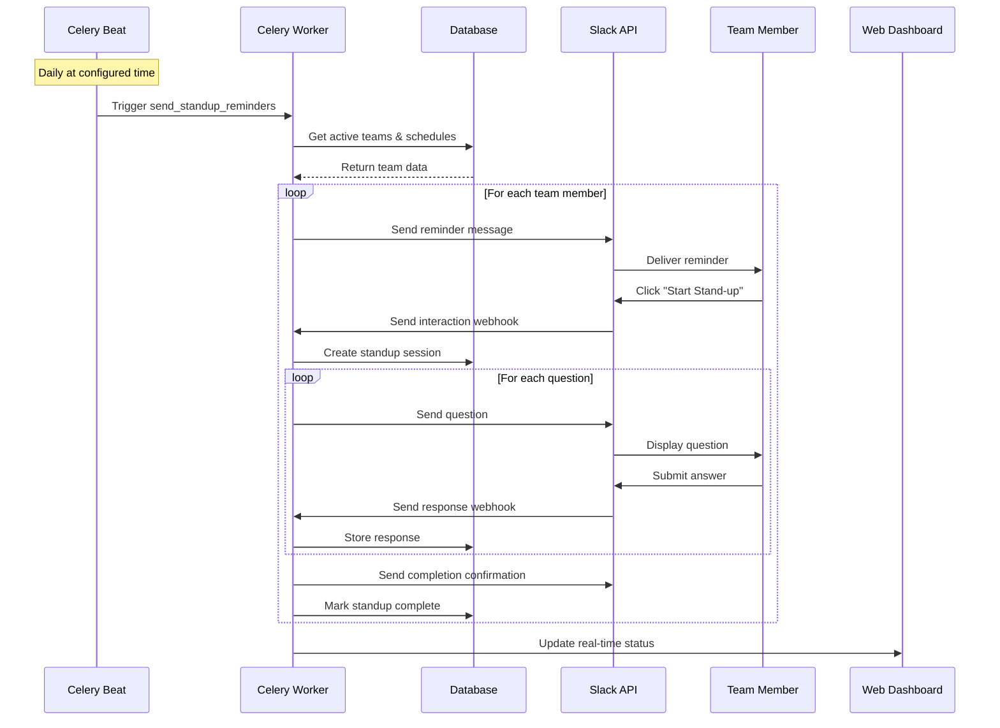

## 4. Follow-up Reminder System

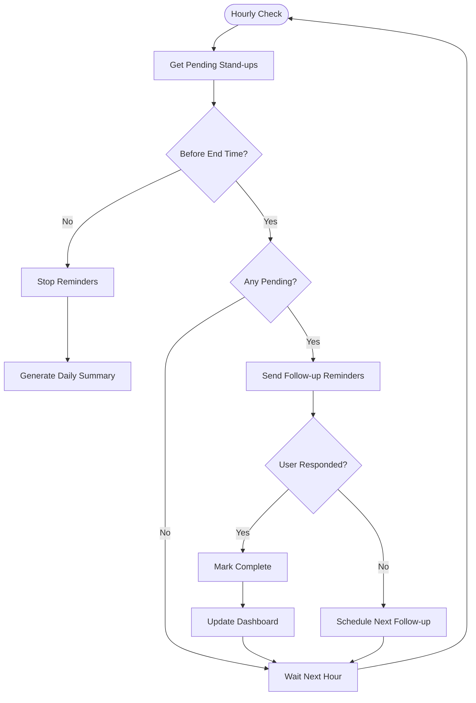

## 5. Slack Bot Interaction Flow

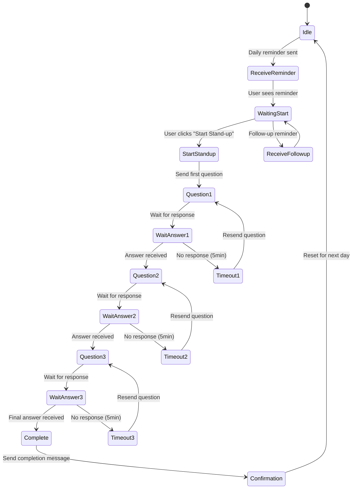

## 6. Data Flow and Storage

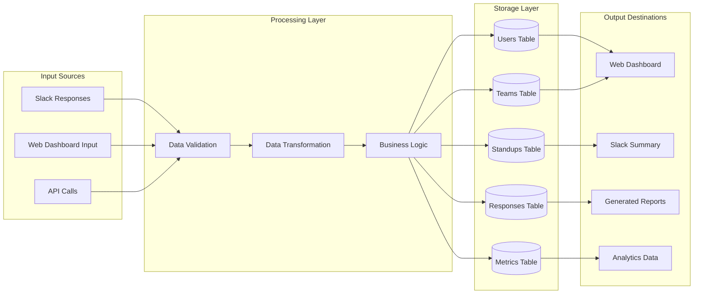

## 7. Summary Generation and Reporting Flow

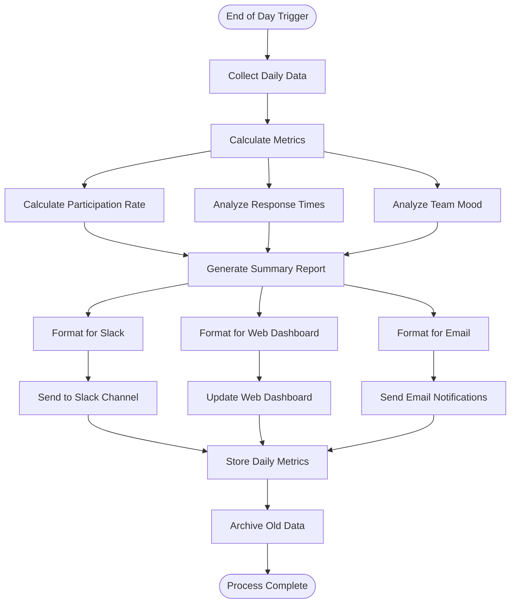

## 8. Error Handling and Recovery Flow

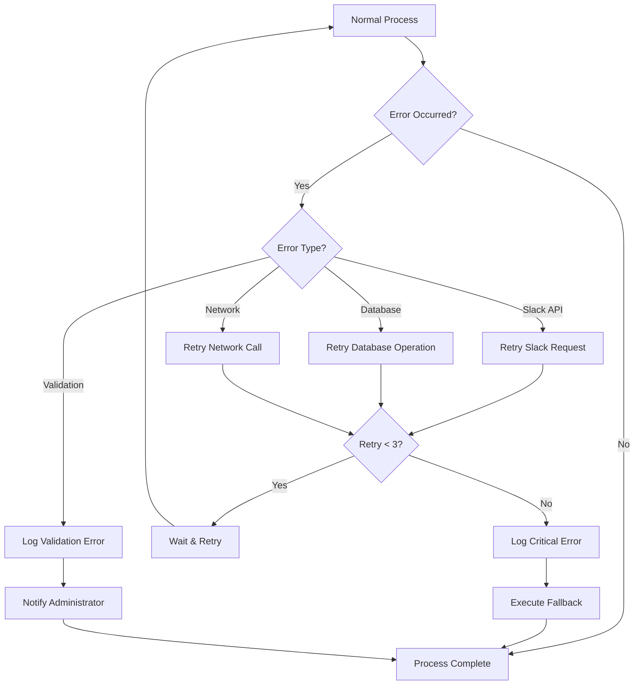

## 9. User Permission and Role Flow

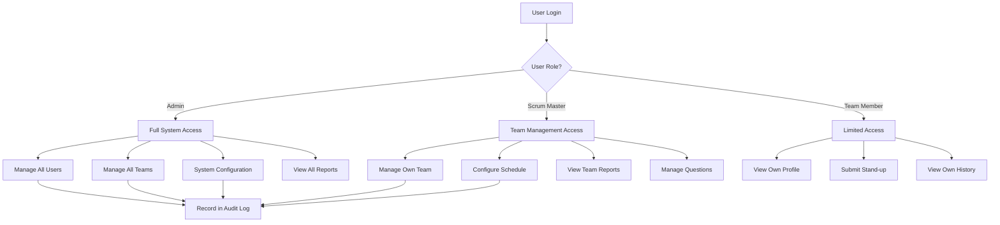

## 10. Notification and Communication Flow

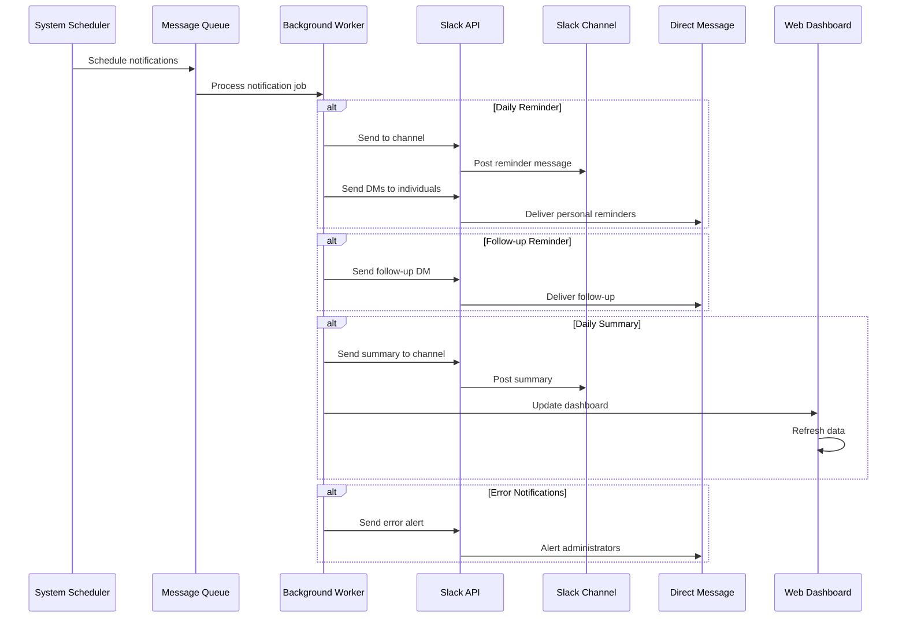

## Technical Implementation Notes

### Key Components

- **Django Apps**: authentication, teams, standups, slack_integration
- **Celery Tasks**: Automated scheduling and background processing
- **Slack Integration**: Bot framework with webhook handling
- **Database Models**: User, Team, Standup, Response, Metrics
- **API Endpoints**: RESTful design for frontend communication

### Data Flow Security

- All API communications use HTTPS
- Slack webhooks include signature verification
- Database operations use parameterized queries
- User authentication required for all operations
- Role-based access control implemented

### Scalability Considerations

- Horizontal scaling support for Celery workers
- Database indexing for performance
- Redis caching for frequently accessed data
- Async processing for Slack interactions
- Load balancing for web requests

This flow diagram provides a comprehensive view of the Daily Stand Up App's architecture and operational flows, supporting both technical implementation and user understanding of the system's behavior.
